# Benchmarking Structural and Chromatic Robustness: CNN vs. ViT in Autonomous Driving Analysis
This project evaluates the performance and error convergence of Convolutional Neural Networks vs the Vision Transformer architecture. The study analyzes the impact of specific image transformations—RGB, HSV (Grayscale), and Sobel Edge Detection—using a multimodal dataset of +50,000 instances (Image + LiDAR) for autonomous navigation scenarios.

The primary metrics used for success assessment are Mean Absolute Error (MAE) and Mean Squared Error (MSE).

## Inquiries & Code Access
**Due to privacy and intellectual property considerations, the full source code is hosted in a secure private repository. Verified academic supervisors and recruiters may request access via the contact information provided in my GitHub Profile Bio or by opening a GitHub Issue in this repository.**


## Research Question
Does image preprocessing influence the convergence and generalization behavior of CNN and Visual Transformer architectures?

## Key Technical Findings

**Optimal Performance:** The CNN-HSV architecture achieved the lowest overall error with a MSE of 0.015 and MAE of 0.056, demonstrating a superior inductive bias for luminance-based feature extraction in this specific task.

**Architectural Comparison:** While Vision Transformers (ViT) exhibited rapid learning curves, CNN models maintained better generalization across the 50k samples when processing structural edges (Sobel).

**Data Handling:** Managed a large-scale pipeline integrating LiDAR-derived spatial data with camera-based visual features.

## Methodology & Objectives

The main objective of this project is to understand whether image preprocessing affects the performance of neural networks or not and to identify which pipeline has the most significant impact on training efficiency.

I personally collected, cleaned, processed, trained, and evaluated 6 distinct models to isolate the impact of input representation on architectural efficiency.

The nature of the project is a regression problem becasue the network needs to infer linear **velocity and angular velocity** which give us the number of neurons for our exit layer (2).

**Networks architectures**

- **CNN Suite:** RGB, HSV (Grayscale), and Sobel.
  - It is constructed with 3 convolutional layers, increasing the number of kernels applied to the images.
  - Each kernel is 3*3 and a stride of 2.
  - Padding type: "same" to reduce spatial dimensionality.
  - Normalization layer used Batch normalization to accelerate convergence and keep training steady.
  - Activation function: ReLU.
  - To reduce overfitting I used Global Average Pooling.
  - Dense layer is made by 64 neurons.
  - 2 exit neurons to predict linear velocity and angular velocity.

Based on the paper **An image is Worth 16x16 Words (Dosovitskiy et al.)** and some internet resouces (Deep.Findr) I looked to adapt a architecture for ViT. 
- **ViT Suite:** RGB, HSV (Grayscale), and Sobel.
  - 16*16 patches size for keeping complexity
  - Embedding space dimension: 128 to keep spacial variations.
  - 4 deep layers with 4 attention heads to keep balance.
  - Global Average Pooling to keep a global representation of the image.

The dataset was split on a 80:20 ratio following scholar standards.
[add image of the dataset characteristics]

## Dataset Description
The dataset consists of over 50,000 synchronized samples collected from an autonomous Ackermann-steer robotic platform. Images are collected with the following especifications:

- Total samples: ~50,000
- Train/Test split: 80/20
- Collected images:
  - Width: 800 pixels
  - Height: 600 pixels
- Input resolution: 128x128
- Prediction targets:
  - Linear velocity
  - Angular velocity


**Preprocessing**
I applied some techniques based on my research and decided the following:
- Each image was resized to 128*128 pixels
- Colorspaces
  - RGB color space (normal)
  - HSV greyscale (by separating channels H, S, V)
   - For HSV I applied adaptative histogram equalitation (CLAHE)  
  -  Sobel edge detector 

Each sample includes:
- RGB camera image
- LiDAR-derived spatial representation
- Telemetry data (steering angle, velocity)

Data was collected across multiple driving sessions and later cleaned, deduplicated, and validated through a custom preprocessing pipeline.

## Conclusions

Experimental results show that architectural performance varies significantly based on the dataset's nature. We observed specific patterns inherent to each architecture: CNNs exhibited superior efficiency in reducing Mean Squared Error (MSE), while the Vision Transformer (ViT) architecture showed similar patterns across all cases but was prone to overfitting.

In the CNN suite, performance trends were consistent across RGB and HSV compared to Sobel, with a notable performance surge in the final epochs. Further testing with extended epoch cycles could clarify whether this is a transient variation or a stable convergence pattern and reach final conclusions.

Regarding Mean Absolute Error (MAE), the CNN architecture for this experiment outperformed ViT, delivering  results without overfitting. In contrast, the ViT architecture displayed a clear relationship between preprocessing and convergence speed: RGB-based ViT reached overfitting twice as fast (Epoch 2.5) as Sobel or HSV (Epoch 5).

In this dataset scale, CNNs showed more stable generalization than ViT architectures, and presents higher error rates compared to CNNs in this specific context. This behavior is likely attributable to the model's complexity and its sensitivity to dataset scale, limiting its generalization capacity within this experimental scenario. Increase the size of the dataset would help to see when does ViT architectures overcome CNN's

**Why did CNNs outperform ViT?**
Despite ViT's ability to capture global context, it appears that 50,000 instances were insufficient for the Transformer to abstract features as efficiently as the CNN’s local inductive bias.

**The Role of Preprocessing**
The variance in performance groups confirms that image preprocessing plays a critical role in model efficiency. Certain architectures benefit more from specific feature extractions (like HSV or Sobel), opening the door for new preprocessing configurations to enhance autonomous driving systems.

## Model Performance Summary

```
| Model | Preprocessing |  MAE  |  MSE  |

|  CNN  |     HSV       | 0.056 | 0.015 |
|  CNN  |     RGB       | 0.057 | 0.0157|
|  CNN  |     Sobel     | 0.091 | 0.026 |
|  ViT  |     HSV       | 0.157 | 0.044 |
|  ViT  |     RGB       | 0.156 | 0.044 |
|  ViT  |     Sobel     | 0.158 | 0.044 |
```

## Future Work

I aim to:
- Real-World Deployment: Test these models on a physical vehicle at the LKE Laboratory to measure performance in real-world environments.
- Advanced Techniques: Integrate the Hough Transform and larger datasets for deeper training.
- Hybrid Refinement: Finalize the development of the hybrid network to push the boundaries of artificial neural networks in autonomous navigation.

**Proposed Hybrid Architecture**
Based on these findings—where CNNs are more efficient feature extractors for mid-sized datasets—the next step is to explore a Hybrid Convolutional-Transformer Architecture.
- CNN Layer: Dedicated to low-level feature extraction.
- ViT Layer: Responsible for high-level global decision-making.
- Regularization: Implementation of a Dropout layer (0.5 rate) to evaluate improvements in generalization.

**Target:** 

CNN (Feature Extraction) -> ViT (Decision Layers) = Optimized Performance?

## Infraestructure

**Computing & Robotics Hardware**
- **Workstation:** Acer Nitro 5 (Intel Core i7 12th Gen) + NVIDIA GeForce RTX 4050 (Training environment).
- **Edge Computing:** Raspberry Pi 5 (Target deployment for real-time inference).
- **Vehicle:** Autonomous Ackermann-steer platform equipped with LD06 LiDAR and camera.

**Software Ecosystem**
- **Frameworks:** TensorFlow (Core Deep Learning).
- **Computer Vision:** OpenCV (Feature engineering & preprocessing).
- **Language:** Python 3.10+ (Data pipeline & model orchestration).


## System Architecture & Data Pipeline

The project follows a modular structure designed for scalability and data integrity in autonomous driving datasets.

**1. Data Engineering Pipeline**

To ensure quality training samples, I developed a multi-stage preprocessing workflow:

- Data Aggregation: append_session.py allows incremental dataset growth without full rebuilds.
- Data Preprocessing:
  - deduplicate_dataset.py: Removes redundant frames to prevent overfitting.
  - clean_dataset.py: Ensures referential integrity between RGB images, LiDAR point clouds, and telemetry CSVs.
  - validate_dataset.py: Final verification of dataset readiness for training.
- Preprocessing Suites: Dedicated modules for RGB, Sobel (Edge Detection), and HSV (Luminance) feature extraction.

**2. Directory Structure**
```
project_root
├── data_logs/          			# Raw vehicle telemetry and sensor data
├── robot/             			  # Processed dataset (Unified images + LiDAR)
│   	└── processed/     	  	# Filtered images (Sobel, HSV)
├── training/           			# Model definitions & training scripts
│   ├── train.py        			# CNN training suite
│   ├── vis_transformer.py 		# ViT training suite
│   └── metrics.py      		  # Custom evaluation library
└── preprocessing/      		  # Feature engineering scripts
```
**3. Training & Evaluation**

I implemented a comparative framework (models_comparison.py) to evaluate how different visual representations impact the convergence of CNNs vs. Vision Transformers.

## Execution Guide & Workflow

Follow these steps to initialize the environment, process the multimodal data, and prepare the dataset for training.

**1. Data Initialization**
Place all raw data folders into the data_logs directory to establish the workspace within the /robot directory.
```
project_root/
└── data_logs/
    ├── images/
    ├── lidar_images/
    └── csv/
```
**1.5. Incremental Data Loading**
To add a new session without rebuilding the entire dataset, place the folder in /add_datasets and run:

```python append_session.py add_datasets/your_folder_name```

The script automatically migrates images and LiDAR files to the global repository and updates the master CSV.

**2. Data Sanitization & Deduplication**
Once the global dataset is consolidated (global.csv), remove redundant entries to prevent overfitting:

```python -m deduplicate_dataset```

**3. Integrity Cleaning**
Run the cleaning script to ensure referential integrity. This step verifies that every record in global_dedup.csv has its corresponding image and LiDAR file present:

```python -m clean_dataset```

**4. Final Validation**
Execute the validation suite to confirm the dataset is structurally sound and ready for feature engineering:

```python -m validate_dataset```

**5. Feature Engineering (Preprocessing)**
Generate the specific image representations for training by executing the following modules:

```
python -m preprocess.preprocess_rgb
python -m preprocess.preprocess_sobel
python -m preprocess.preprocess_hsv
```

After these steps are completed, the pipeline is ready for Model Training.
```
python -m training.train --mode rgb/sobel/hsv               #(for CNN training)
python -m training.vis_transformer --mode rgb/sobel/hsv     #(for ViT training)
```

## Graphical Workflow Summary
```
dataset.py (Dataset Integrator)
      ↓
append_session.py (Data Aggregation)
      ↓
deduplicate_dataset.py (Redundancy Removal)
      ↓
clean_dataset.py (Broken Reference Removal)
      ↓
validate_dataset.py (Final Integrity Check)
      ↓
Preprocessing Suite (RGB, Sobel, HSV)
      ↓
Model Training (CNN / ViT)
```

## Metrics and Images of the Project
**MAE**
```
--CNN--
- hsv: 0.056
- rgb: 0.057
- sobel: 0.091

--ViT--
- vit_hsv: 0.157
- vit_rgb: 0.156
- vit_sobel: 0.158
```
**MAE CNN**

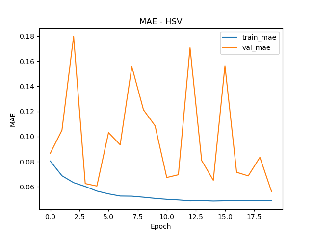
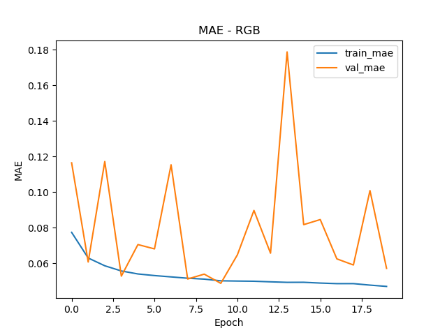
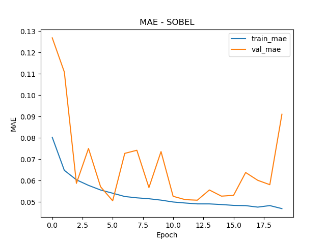

**MAE ViT**

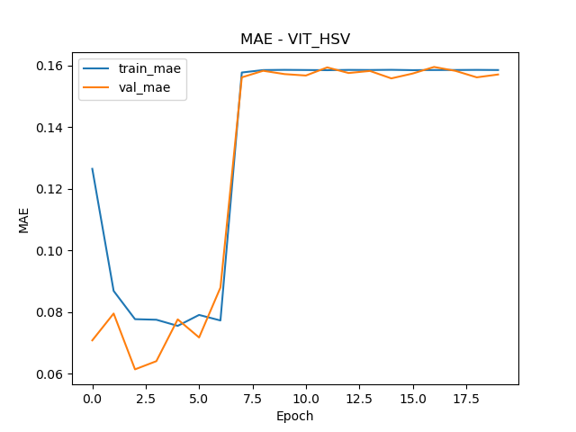
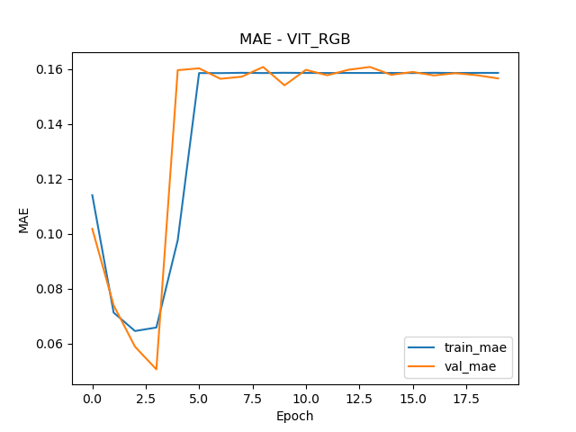
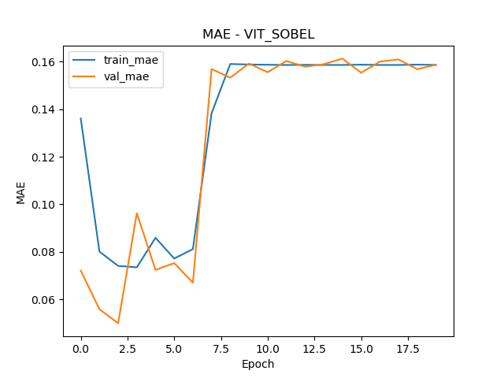


**MSE:**
```
--CNN--
- hsv: 0.015
- rgb: 0.0157
- sobel: 0.026

--ViT-- 
- hsv: 0.044
- rgb: 0.044
- sobel: 0.044
```

**MSE CNN**

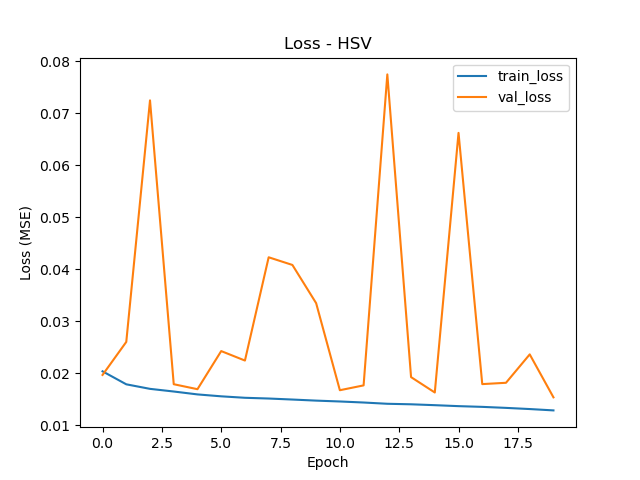
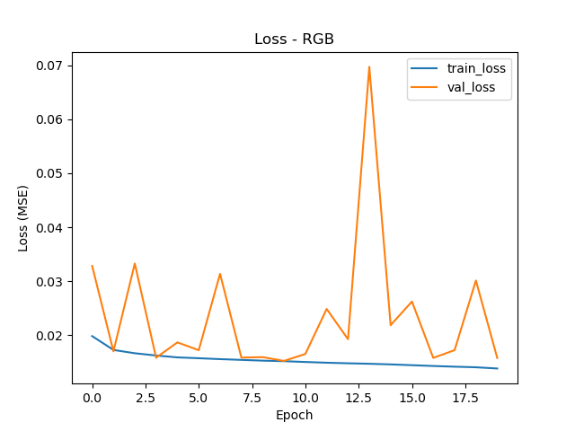
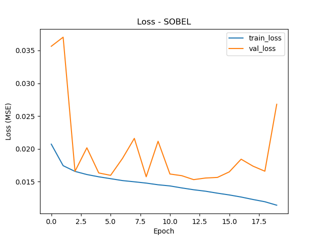

**MSE ViT**

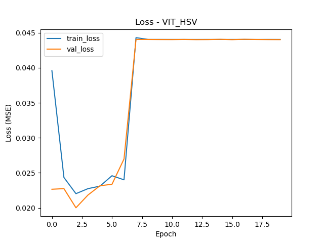
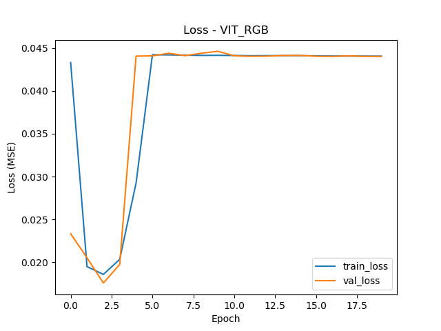
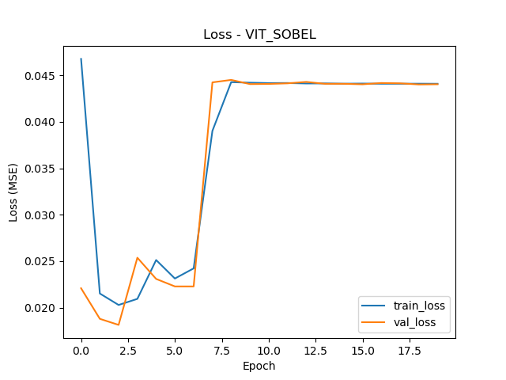

## Images

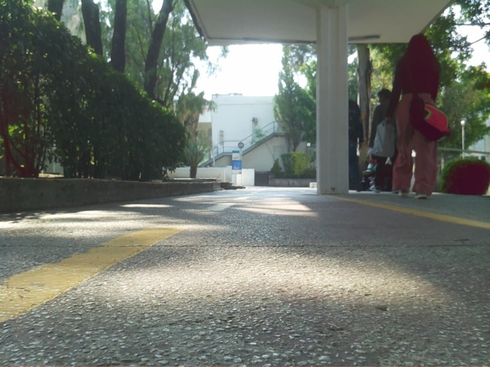
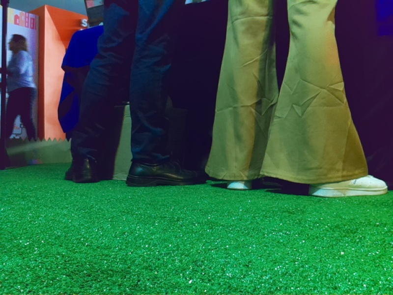
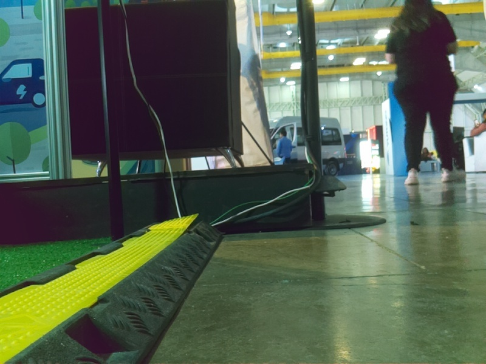
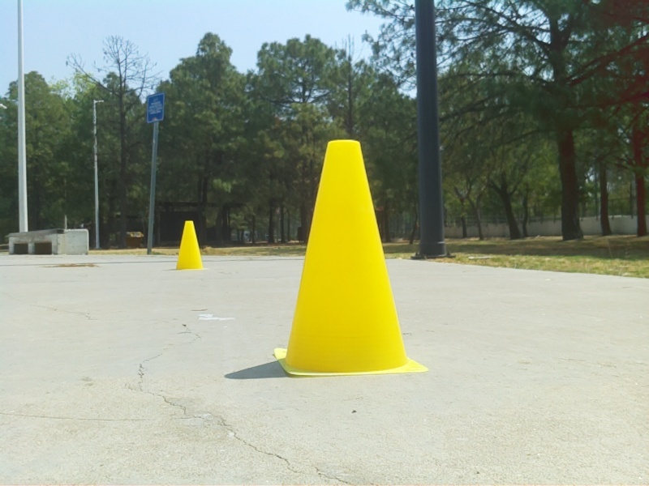
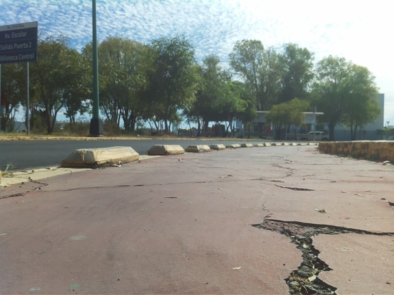
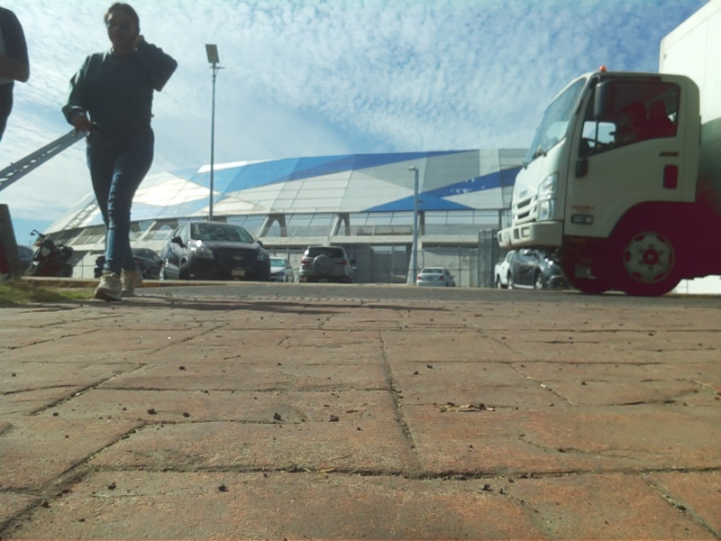
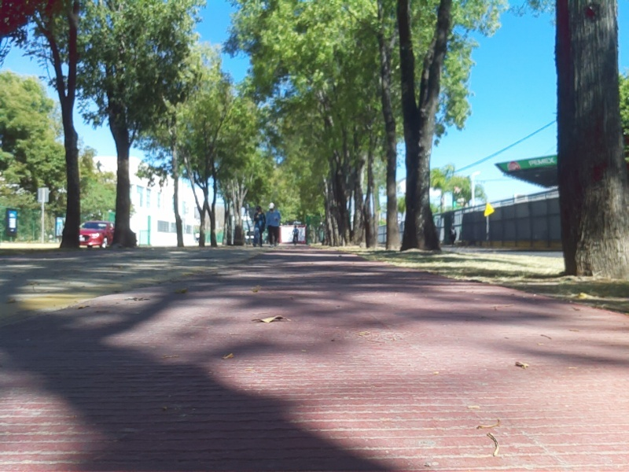
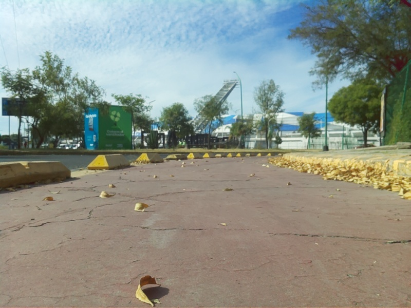

**LiDAR**

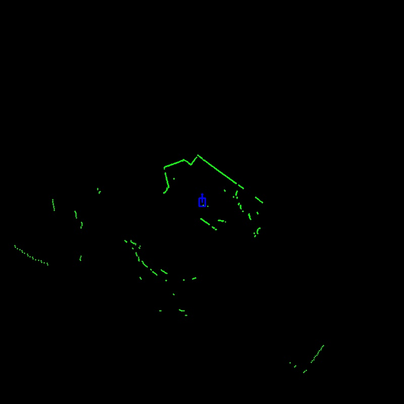
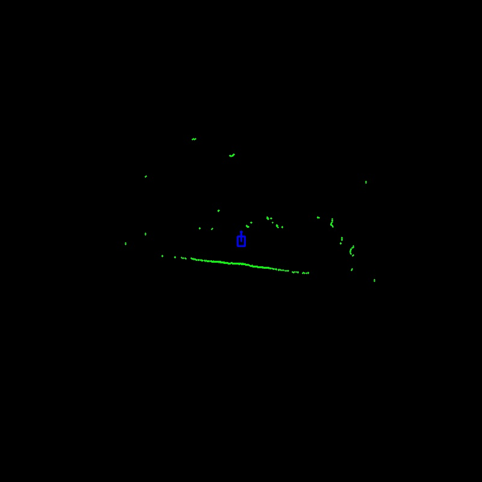
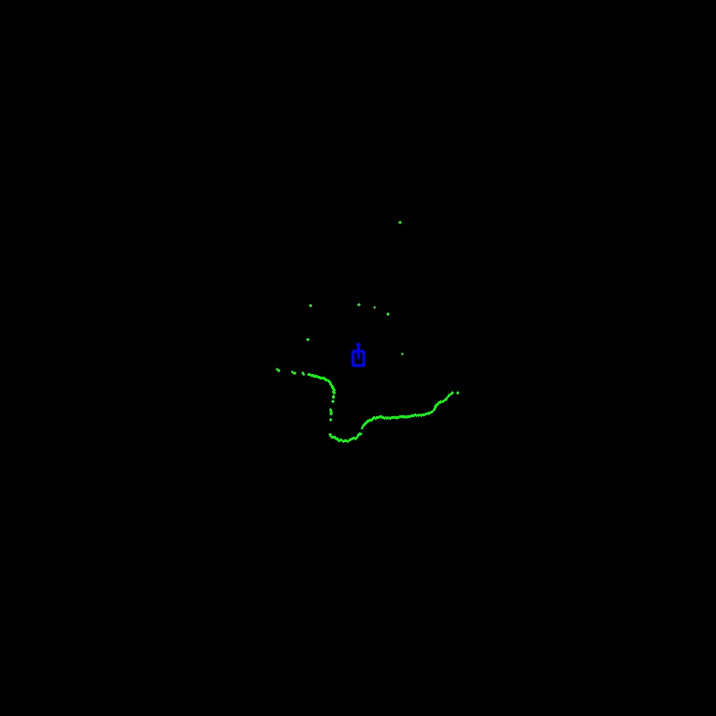
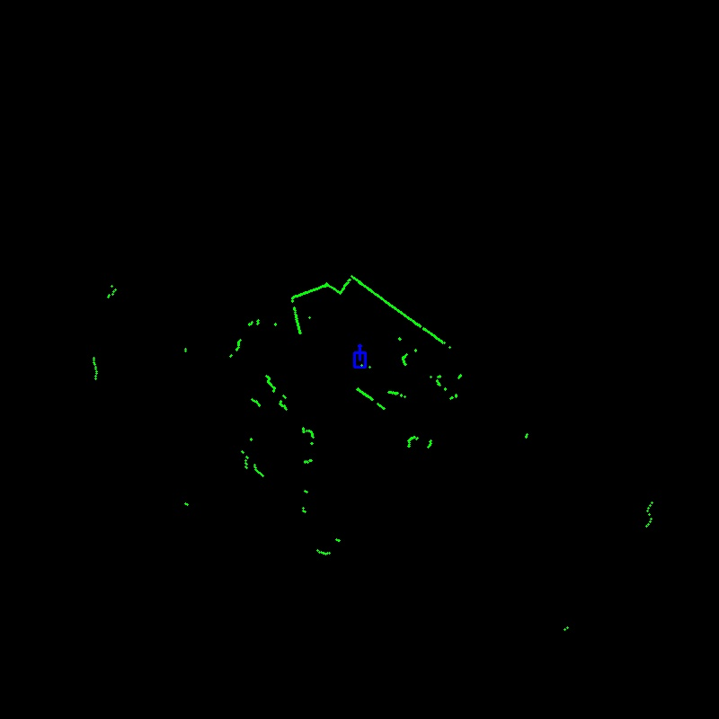

**Preprocessing**


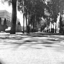
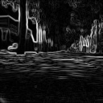

